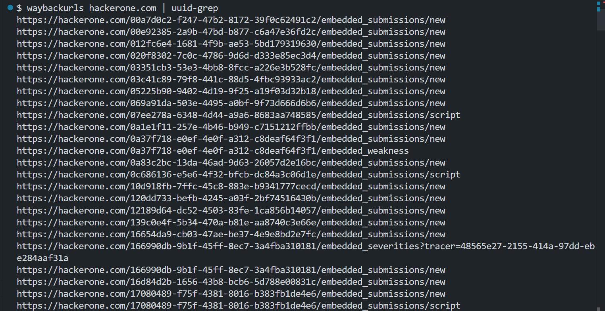

# uuid-grep

Simple CLI utility to search UUID from string

## Installation

```bash
npm install uuid-grep
```

## Usage

### Oneliner

```bash
waybackurls target.com | uuid-grep
```



### From File

```bash
cat input.txt | uuid-grep
```
